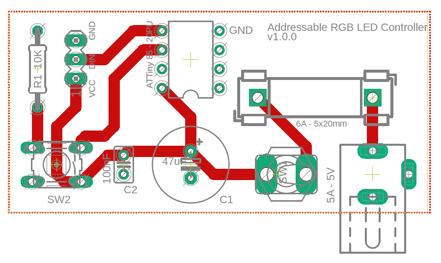

# ARGB-LS-Controller
Circuit diagram, PCB layout and code for an ATTiny85 powered, addressable RGB LED strip controller.

# Repository organization

The circuit and board were developed using AutoDesk EAGLE and all files are available in the "Hardware files" folder. Schematic and Board layout PDFs can be found in the "Resources" folder. Controller code can be found in the "Code" folder.

# Project Requirements and Design

The PCB was developed to control any addressable RGB LED strip that uses WS2812B or similar LEDs that take 3 inputs (VCC, GND and Data/DIN) using any DIP8 packaged microcontroller.

All board traces are spec'd to handle up to 5A of current for PCBs fabricated at 1.6mm thickness and 1oz/mm2 allowing for LED strips of up to 88 LED long strips.

Circuit is current-protected up to 6A through a glass fuse at power input and power signal is conditioned using both input capacitors.

R1 is a pull-down resistor for the momentary SW2 push-button that allows for additional inputs to the microcontroller.

The board was developed to handle led-strip control through an ATTiny85 in the DIP8 packaging but should be compatible with all ATTiny microcontrollers in the same outer packaging.

All components are through-hole to reduce cost and facilitate construction.

# Bill of Materials

Besides the board and the led strip:

- 10K ohm resistor (Count: 1)
- 47uF electrolytic capacitor (Count: 1)
- 100nF ceramic capacitor (Count: 1)
- ATTiny85-20PU in DIP8 (Count: 1)
- 6A strand-glass fuse and support (Count: 1)
- Normally-open 4 terminal momentary push-button (Count: 1)
- 5.5mm barrel jack socket (Count: 1)
- SPST switch - Optional (Count: 1)
- DIP8 socket - Optional (Count: 1)

# Quirks

Version 1.0.0 of the board layout/schematic has improper pitch width for the 3 vias used for signal output to the led strip to be used as terminal bars. Pitch between terminals of the fuse are also non-standard, might require customization.
